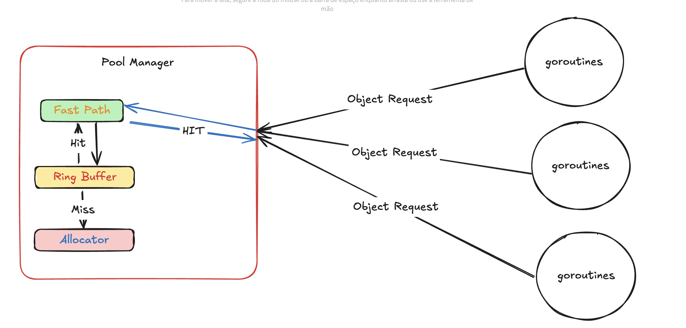

# Object Pool Design Documentation

## Overview

This object pool implementation is designed to efficiently manage object lifecycle and memory usage while maintaining high performance under various load conditions. The system uses a multi-tiered approach with a fast path (L1 cache) and a main pool (L2) to optimize object access patterns.

## Architecture

### Core Components

1. **Fast Path (L1 Cache)**

   - A channel-based cache layer for quick object access
   - Configurable size and growth behavior
   - Proactive refilling from the main pool
   - Optional dynamic growth capability

2. **Main Pool (L2)**

   - Ring buffer implementation for efficient object storage
   - Handles object creation and lifecycle management
   - Implements growth and shrink strategies
   - Manages object allocation and deallocation

3. **Configuration System**
   - Highly configurable parameters for fine-tuning behavior
   - Builder pattern for easy configuration
   - Default values for common use cases
   - Validation of configuration parameters

### Key Features

- **Adaptive Growth**: Implements both exponential and fixed growth strategies
- **Intelligent Shrinking**: Configurable shrink behavior based on utilization
- **Fast Path Optimization**: L1 cache for high-performance object access
- **Memory Management**: Configurable hard limits and capacity controls
- **Performance Monitoring**: Built-in statistics and metrics collection

## Configuration Options

### Pool Configuration

- `initialCapacity`: Starting size of the pool
- `hardLimit`: Maximum number of objects allowed
- `growth`: Growth strategy parameters
- `shrink`: Shrink behavior parameters
- `fastPath`: L1 cache configuration
- `ringBufferConfig`: Main pool configuration

### Growth Parameters

- `exponentialThresholdFactor`: Threshold for switching growth modes
- `growthPercent`: Percentage-based growth in exponential mode
- `fixedGrowthFactor`: Fixed growth amount in fixed mode

### Shrink Parameters

- `checkInterval`: Frequency of shrink checks
- `idleThreshold`: Minimum idle time before shrinking
- `minUtilizationBeforeShrink`: Utilization threshold for shrinking
- `shrinkPercent`: Amount to reduce pool size by
- `maxConsecutiveShrinks`: Limit on consecutive shrink operations

### Fast Path Parameters

- `bufferSize`: L1 cache capacity
- `growthEventsTrigger`: Events needed for L1 growth
- `shrinkEventsTrigger`: Events needed for L1 shrinking
- `fillAggressiveness`: How aggressively to refill L1
- `refillPercent`: Threshold for L1 refilling

## Performance Considerations

### Memory Usage

- The pool balances between memory efficiency and performance
- Hard limits prevent unbounded growth
- Shrink mechanisms reclaim unused memory
- L1 cache size affects memory footprint

### Latency

- Fast path provides low-latency access to frequently used objects
- Growth and shrink operations are designed to minimize impact
- Configuration can be tuned for specific latency requirements

### Concurrency

- Thread-safe implementation
- Lock-free fast path for common operations
- Efficient synchronization for pool management
- Configurable for different concurrency patterns

## Best Practices

1. Set appropriate initial capacity based on expected load
2. Configure hard limits based on available memory
3. Tune growth and shrink parameters for your workload
4. Monitor pool statistics for optimization
5. Use appropriate fast path settings for your access patterns

## Monitoring and Metrics

The pool provides various metrics for monitoring:

- Objects in use
- Available objects
- Peak usage
- Current capacity
- Fast path hit/miss rates
- Growth and shrink events
- Utilization statistics
