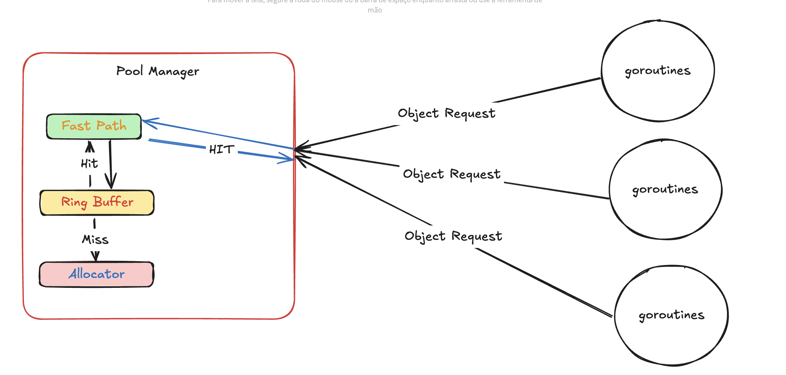

# PoolX

[](https://pkg.go.dev/github.com/AlexsanderHamir/PoolX/v2)
[](https://goreportcard.com/report/github.com/AlexsanderHamir/PoolX)
[](LICENSE)
[](https://github.com/AlexsanderHamir/PoolX/actions/workflows/test.yml)

A highly configurable object pool implementation designed to control object creation under high-concurrency scenarios.

> **Documentation**:
>
> - **API Reference**: For detailed API reference and interface definitions, see [pool/api.go](../pool/api.go)
> - **Technical Details**: For in-depth technical explanations and implementation details, see [docs/technical_explanations/](technical_explanations/)
> - **Design**: For design decisions, architecture overview, and component interactions, see [docs/design_docs.md](design_docs.md)
> - **Code Examples**: For practical usage examples and implementation patterns, see [pool/code_examples/](../code_examples)



## Installation

```bash
go get github.com/AlexsanderHamir/PoolX/v2
```

## Quick Start

```go
import (
    "github.com/AlexsanderHamir/PoolX/v2/pool/code_examples/configs"
    "time"
)

// Define your object type
type Example struct {
    ID   int
    Name string
    Data []byte
}

// Create a new pool configuration using one of the preset configs
// Don't use this in production, use it as inspiration.
config := configs.CreateHighThroughputConfig()

// Create allocator and cleaner functions
allocator := func() *Example {
    return &Example{}
}

cleaner := func(obj *Example) {
    obj.ID = 0
    obj.Name = ""
    obj.Data = nil
}

// If provided, this function replaces the allocator. Useful when allocation is expensive.
// The example below performs a shallow copy.
// If the struct contains reference types, you'll need to manually reinitialize them as needed,
// since all instances will share the same underlying references.
cloner := func(obj *configs.Example) *configs.Example {
			dst := *obj
			return &dst
}

// Create and use the pool
pool, err := pool.NewPool(config, allocator, cleaner, cloner)
if err != nil {
    panic(err)
}
```

## Key Features

### 1. Dynamic Resizing

- **Ring Buffer**: Automatically grows and shrinks based on usage patterns
  - Configurable growth thresholds and rates
  - Smart shrinking based on utilization metrics
  - Customizable cooldown periods and stability requirements
- **Fast Path (L1 Cache)**: Provides quick access to frequently used objects
  - Independent growth and shrink policies
  - Configurable event triggers for resizing
  - Automatic refill based on utilization
- **Allocation Strategy**: Controls how objects are allocated in bulk
  - Configurable allocation percentage
  - Batch size control for efficient allocation

### 2. Configuration Options

PoolX provides extensive configuration options through a fluent builder interface. Here are the main configuration categories:

#### Basic Pool Configuration

- **Initial Capacity**: Starting size of both ring buffer and fast path
- **Hard Limit**: Maximum number of objects the pool can grow to
- **Channel Growth**: Enable/disable dynamic growth of the fast path channel

#### Ring Buffer Configuration

- **Blocking Mode**: Control whether operations block when buffer is full/empty
- **Timeouts**: Configure read/write operation timeouts
- **Growth Strategy**:
  - Threshold Factor: When to switch from exponential to controlled growth
  - Big Growth Factor: Growth rate below threshold (e.g., 0.75 for 75% growth)
  - Controlled Growth Factor: Fixed step size after threshold
- **Shrink Strategy**:
  - Check Interval: Time between shrink eligibility checks
  - Shrink Cooldown: Minimum time between shrink operations
  - Utilization Threshold: Minimum utilization before shrinking
  - Stable Rounds: Required stable underutilization rounds
  - Shrink Percent: Percentage reduction per shrink
  - Min Capacity: Minimum pool size after shrinking
  - Max Consecutive Shrinks: Limit on back-to-back shrinks

#### Fast Path (L1 Cache) Configuration

- **Initial Size**: Starting capacity of the fast path buffer
- **Growth Events**: Number of events before fast path grows
- **Shrink Events**: Number of events before fast path shrinks
- **Fill Aggressiveness**: Initial fill percentage (0-100)
- **Refill Percent**: Threshold for refilling the fast path
- **Growth Strategy**: Similar to ring buffer with separate parameters
- **Shrink Strategy**: Configurable shrink behavior with aggressiveness levels

#### Allocation Strategy

- **Allocation Percent**: Percentage of objects to preallocate
- **Allocation Amount**: Objects to create per request

#### Aggressiveness Levels

PoolX provides predefined shrink aggressiveness levels:

1. **Conservative**: Minimal shrinking, prioritizes performance
2. **Balanced**: Default setting, balanced approach
3. **Aggressive**: More aggressive shrinking
4. **Very Aggressive**: Heavy shrinking
5. **Extreme**: Maximum shrinking

Example configuration:

```go
config := NewPoolConfigBuilder[Example]().
    SetPoolBasicConfigs(1000, 10000, true).
    SetRingBufferBasicConfigs(true, 100*time.Millisecond, 100*time.Millisecond, 0).
    SetRingBufferGrowthConfigs(3000, 0.75, 0.5).
    SetRingBufferShrinkConfigs(
        5*time.Second,    // check interval
        1*time.Second,    // cooldown
        3,                // stable rounds
        32,               // min capacity
        3,                // max consecutive shrinks
        20,               // min utilization
        25,               // shrink percent
    ).
    SetFastPathBasicConfigs(64, 3, 3, 80, 20).
    SetFastPathGrowthConfigs(3000, 0.75, 0.5).
    SetFastPathShrinkConfigs(25, 32).
    SetAllocationStrategy(80, 10).
    Build()
```

## Preset Configurations

PoolX comes with several preset configurations optimized for different use cases:

### High Throughput

```go
config := configs.CreateHighThroughputConfig()
```

Optimized for maximum throughput with:

- Large initial capacity (1000 objects)
- Aggressive growth strategy
- Fast path with high fill aggressiveness
- Bulk allocation strategy

### Memory Constrained

```go
config := configs.CreateMemoryConstrainedConfig()
```

Optimized for memory-constrained systems with:

- Small initial capacity (16 objects)
- Conservative growth strategy
- Efficient memory usage
- Strict capacity limits

### Low Latency

```go
config := configs.CreateLowLatencyConfig()
```

Optimized for low latency with:

- Large initial capacity (512 objects)
- Fast growth response
- High fast path fill rate
- Quick shrink response

### Batch Processing

```go
config := configs.CreateBatchProcessingConfig()
```

Optimized for batch workloads with:

- Balanced initial capacity (128 objects)
- Moderate growth rates
- Efficient batch handling
- Stable shrink behavior

### Real-Time

```go
config := configs.CreateRealTimeConfig()
```

Optimized for real-time systems with:

- Very large initial capacity (1024 objects)
- Ultra-fast growth response
- Maximum fast path fill rate
- Minimal shrink impact

### Balanced

```go
config := configs.CreateBalancedConfig()
```

General-purpose configuration with:

- Moderate initial capacity (192 objects)
- Balanced growth and shrink rates
- Good all-around performance
- Stable behavior

## Important Notes

1. **Type Safety**: Only pointers can be stored in the pool
2. **Default Behavior**: Ring buffer operates in blocking mode by default
3. **Performance**: Resizing operations are expensive - tune growth/shrink parameters carefully
4. **Configuration**: Use preset configurations for common use cases or create custom ones for specific needs
5. **Memory Management**: Consider using memory-constrained config for systems with limited resources

## Contributing

1. Fork the repository
2. Create a feature branch
3. Make your changes
4. Run tests: `go test ./...`
5. Submit a pull request

For bug reports and feature requests, please open a GitHub Issue.

## License

This project is licensed under the MIT License - see the [LICENSE](LICENSE) file for details.
