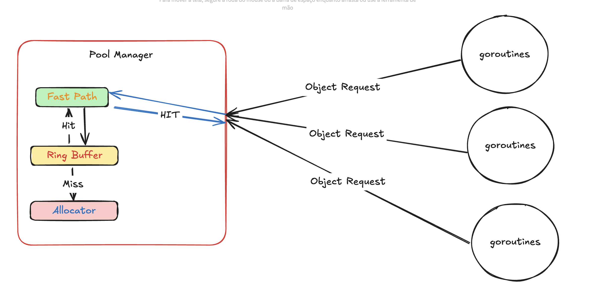

# Pool Design Documentation

## Overview

This object pool is designed to control object creation according to its configuration.

## Architecture

### Core Components

**Fast Path (L1 Cache)**

- The ring buffer is fast but requires a lock on every request to get an object. To reduce mutex overhead, we make fewer but larger requests to the ring buffer (size determined by configuration) and fill a channel with the objects.

**Main Pool (L2)**

- Ring buffer implementation for efficient object storage, it can return nil immediatly, block or block with timeout.

**Configuration System**

- Highly configurable parameters for fine-tuning behavior
- Builder pattern for easy configuration
- Default values for common use cases

**Pool**
The pool object manages the fast path and the ring buffer. It's responsible for growing, shrinking, and other core operations.

### Key Features

- **Adaptive Growth**: Implements both exponential and fixed growth strategies
- **Intelligent Shrinking**: Configurable shrink behavior based on utilization or idleness
- **Fast Path Optimization**: L1 cache for high-performance object access
- **Memory Management**: Configurable hard limits and capacity controls
- **Performance Monitoring**: Built-in statistics and metrics collection

## Configuration Options ()

### Pool Configuration

- `initialCapacity`: Starting size of the pool
- `hardLimit`: Maximum number of objects allowed
- `growth`: Growth strategy parameters
- `shrink`: Shrink behavior parameters
- `fastPath`: L1 cache configuration
- `ringBufferConfig`: Main pool configuration

### Growth Parameters

- `exponentialThresholdFactor`: Threshold for switching growth modes
- `growthPercent`: Percentage-based growth in exponential mode
- `fixedGrowthFactor`: Fixed growth amount in fixed mode

### Shrink Parameters

- `enforceCustomConfig`: Removes all default configuration
- `aggressivenessLevel`: High-level control (0-5) that adjusts shrink parameters
- `checkInterval`: Frequency of shrink checks
- `idleThreshold`: Minimum idle time before shrinking
- `minUtilizationBeforeShrink`: Utilization threshold for shrinking
- `shrinkPercent`: Amount to reduce pool size by
- `maxConsecutiveShrinks`: Limit on consecutive shrink operations
- `minIdleBeforeShrink`: Number of consecutive idle checks required before shrinking
- `shrinkCooldown`: Minimum time between consecutive shrink operations
- `stableUnderutilizationRounds`: Consecutive underutilization checks needed before shrinking
- `minCapacity`: Minimum allowed capacity after shrinking

### Fast Path Parameters

- `bufferSize`: L1 cache capacity
- `growthEventsTrigger`: Events needed for L1 growth
- `shrinkEventsTrigger`: Events needed for L1 shrinking
- `fillAggressiveness`: How aggressively to refill L1
- `refillPercent`: Threshold for L1 refilling

## Best Practices

1. Set appropriate initial capacity based on expected load
2. Configure hard limits based on available memory
3. Tune growth and shrink parameters for your workload
4. Monitor pool statistics for optimization
5. Use appropriate fast path settings for your access patterns
6. Ensure sufficient object capacity for your workload - undersizing the pool relative to request volume will result in excessive blocking or dropped goroutines.

## Monitoring and Metrics

The pool provides various metrics for monitoring:

- Objects in use
- Available objects
- Peak usage
- Current capacity
- Fast path hit/miss rates
- Growth and shrink events
- Utilization statistics
